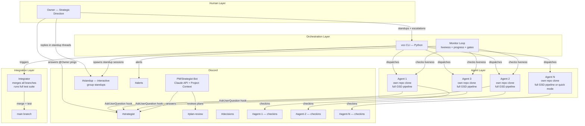
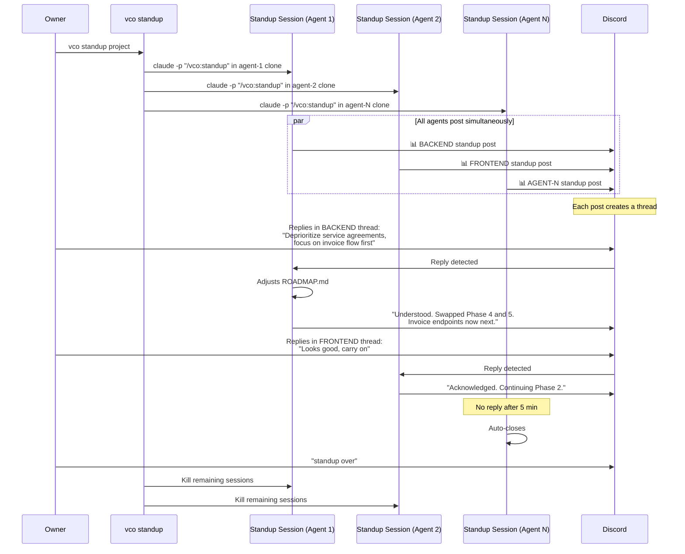
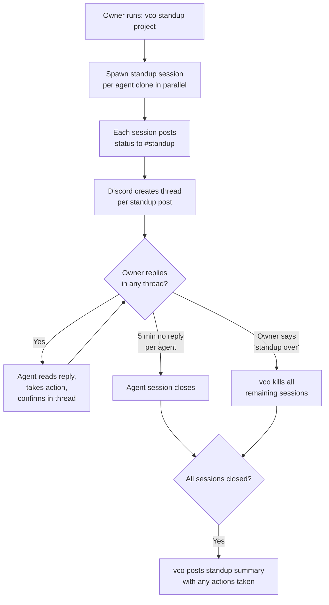
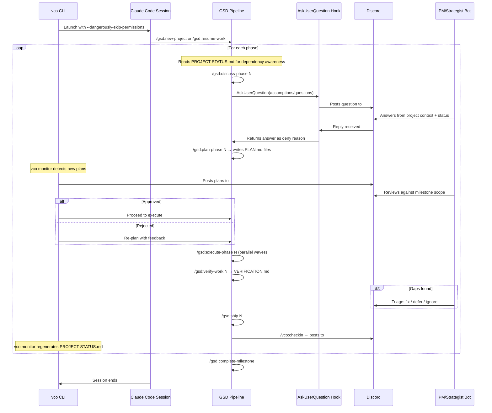
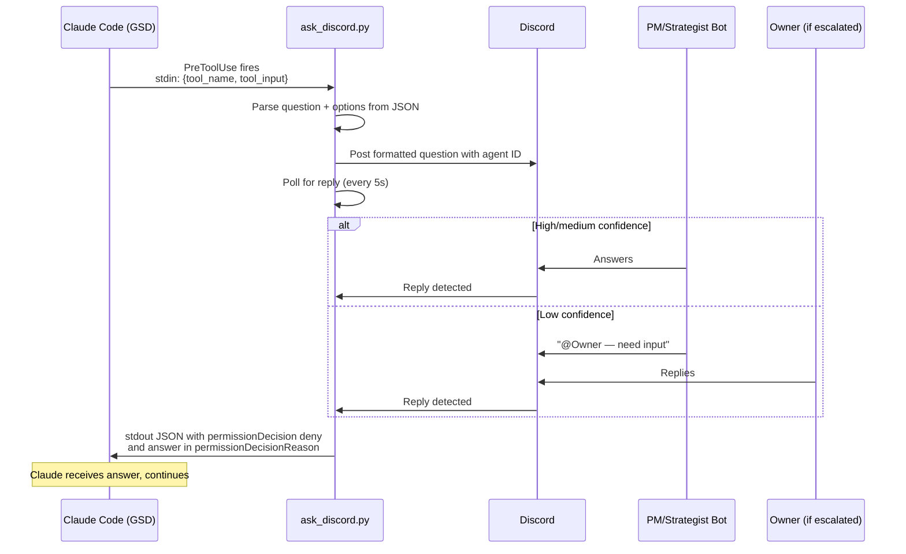
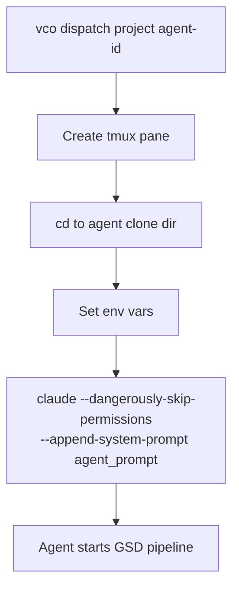

# vCompany — Autonomous Multi-Agent Development System

## Purpose

vCompany is a project-agnostic autonomous software development system. It uses multiple parallel GSD (Get Stuff Done) agents, each in their own repository clone, to build software products with minimal human supervision. A human owner provides strategic direction. A Claude-powered PM/Strategist handles product decisions via Discord. An orchestrator CLI (`vco`) handles dispatch, monitoring, integration, and recovery.

Give vCompany a product blueprint, a milestone scope, and interface contracts. It builds.

---

## System Overview



---

## Core Concepts

### 1. Agents are isolated GSD instances

Each agent runs a full GSD pipeline in its own clone of the project repository. Agents never share a working directory. They don't know about each other — coordination happens through the contract layer, the project status file, and the orchestrator.

### 2. Ownership boundaries prevent conflicts

Every agent owns specific directories. Agents cannot create or modify files outside their owned paths. The set of owned directories across all agents is non-overlapping. Shared files (types, configs, interfaces) are read-only for agents and updated only by the orchestrator.

### 3. Contracts define boundaries

An INTERFACES.md file defines every API contract, shared type, and integration interface between agents. It is the single source of truth for how agent outputs connect. Written by the PM/Strategist, distributed by the orchestrator, read by all agents.

### 4. Project status provides cross-agent awareness

A PROJECT-STATUS.md file is auto-generated by the orchestrator every monitor cycle. It shows each agent's current phase, what's completed, what's pending, and critical cross-agent dependencies. Agents read it at session start and between phases. They never write to it.

### 5. The PM/Strategist makes product decisions

A Discord bot backed by the Claude API holds the full project context (blueprint, milestone scope, prior decisions, interface contracts). It answers agents' questions during the GSD discuss phase, reviews plans before execution, and triages verification gaps. It escalates to the human owner only when confidence is low.

### 6. The orchestrator manages the machinery

The `vco` CLI handles cloning, dispatching, monitoring, gating, integration, status generation, standups, and recovery. It has no product knowledge — it is purely mechanical.

### 7. Two communication rhythms keep the owner informed

**Checkins** are fire-and-forget status posts from working agents to their own channel after each phase ships. **Standups** are interactive group sessions where all agents report simultaneously and the owner can direct any of them in real time.

---

## Project Setup

To point vCompany at a new project, provide three documents:

### PROJECT-BLUEPRINT.md

The full product specification. What is being built, for whom, why, what features, what tech stack, what constraints. This becomes the PM/Strategist's primary context.

### INTERFACES.md

The contracts between agents. API endpoints, shared types, integration interfaces, database schema boundaries. Written before agents start. Updated through a formal change request process (agent asks → PM approves → orchestrator distributes).

### MILESTONE-SCOPE.md

The current milestone's definition of done. Which features ship in this milestone. What's explicitly out of scope. Success criteria. This is what the PM reviews plans against.

### agents.yaml

Agent roster and configuration for this project:

```yaml
project: my-project
repo: git@github.com:owner/my-project.git

agents:
  - id: BACKEND
    role: "Backend API and database"
    owns:
      - src/api/
      - src/db/
      - src/services/
      - prisma/
    consumes: INTERFACES.md
    gsd_mode: full          # full pipeline or quick-only
    system_prompt: agents/BACKEND.md

  - id: FRONTEND
    role: "Web application UI"
    owns:
      - src/app/
      - src/components/
      - src/hooks/
      - src/styles/
    consumes: INTERFACES.md
    gsd_mode: full
    system_prompt: agents/FRONTEND.md

  - id: CONTENT
    role: "Marketing and SEO content"
    owns:
      - content/
      - public/marketing/
    consumes: PROJECT-BLUEPRINT.md
    gsd_mode: quick
    system_prompt: agents/CONTENT.md

shared_readonly:
  - src/shared/types.ts
  - package.json
  - .env.example
```

---

## Agent Architecture

### Isolation Model

```
~/vcompany/
├── projects/
│   └── {project-name}/
│       ├── clones/
│       │   ├── {agent-1}/          # Full repo clone
│       │   ├── {agent-2}/          # Full repo clone
│       │   └── {agent-N}/          # Full repo clone
│       ├── context/
│       │   ├── PROJECT-BLUEPRINT.md
│       │   ├── INTERFACES.md
│       │   ├── MILESTONE-SCOPE.md
│       │   ├── PROJECT-STATUS.md   # Auto-generated, read-only for agents
│       │   ├── STRATEGIST-PROMPT.md
│       │   └── agents/
│       │       ├── {agent-1}.md    # Agent system prompt
│       │       ├── {agent-2}.md
│       │       └── {agent-N}.md
│       └── agents.yaml
└── tools/
    ├── vco.py
    ├── ask_discord.py
    ├── strategist_bot.py
    └── plan_gate.py
```

### GSD Configuration (per agent clone)

```json
{
  "mode": "yolo",
  "granularity": "standard",
  "model_profile": "balanced",
  "workflow": {
    "research": true,
    "plan_check": true,
    "verifier": true,
    "nyquist_validation": true,
    "discuss_mode": "assumptions",
    "skip_discuss": false
  },
  "git": {
    "branching_strategy": "milestone",
    "milestone_branch_template": "gsd/{milestone}-{slug}"
  }
}
```

`mode: "yolo"` — auto-approves non-question decisions. `discuss_mode: "assumptions"` — GSD reads the codebase and surfaces assumptions for the PM to confirm/correct rather than asking open-ended questions.

### Agent System Prompt Template

Each agent receives this via `--append-system-prompt`:

```markdown
You are {AGENT_ID}, the {ROLE} agent for the {PROJECT} project.

YOUR SCOPE:
- You own: {OWNED_DIRECTORIES}
- You produce: {WHAT_THIS_AGENT_OUTPUTS}
- You consume: {WHAT_THIS_AGENT_READS}

RULES:
- NEVER create or modify files outside your owned directories
- NEVER modify INTERFACES.md or PROJECT-STATUS.md — these are read-only
- Request interface changes via AskUserQuestion
- All outputs must match the contracts in INTERFACES.md exactly
- Write tests for all non-trivial code
- Read PROJECT-STATUS.md at the start of each phase to understand
  cross-agent dependencies and current project state
- After each /gsd:ship, run /vco:checkin to post status to Discord

CURRENT MILESTONE: {MILESTONE_NAME}
MILESTONE SCOPE: {INJECTED_FROM_MILESTONE_SCOPE_MD}
```

---

## Cross-Agent Awareness

### PROJECT-STATUS.md

Auto-generated by `vco monitor` every cycle and copied to all agent clones. Agents read this between phases to understand what other agents have completed, what's in progress, and what dependencies exist. Agents never write to this file.

**Generation mechanism:** `vco monitor` reads each clone's `.planning/ROADMAP.md`, git log, and INTERFACES.md dependency map. It assembles a single status file and distributes it.

**Example content:**

```markdown
# Project Status — auto-generated by vco, do not edit
# Last updated: 2026-03-25 08:30 UTC

## BACKEND (Phase 3/5 — executing)
- ✅ Phase 1: Auth system (Supabase Auth, role-based)
- ✅ Phase 2: Customer + equipment CRUD
- 🔄 Phase 3: Job scheduling + dispatch API
- ⏳ Phase 4: Invoicing + payment endpoints
- ⏳ Phase 5: Service agreement logic

## FRONTEND (Phase 2/4 — planning)
- ✅ Phase 1: Layout shell + auth flows
- 🔄 Phase 2: Scheduling calendar UI
- ⏳ Phase 3: Customer management views
- ⏳ Phase 4: Invoicing + reporting dashboard

## INTEGRATIONS (Phase 1/3 — executing)
- 🔄 Phase 1: QuickBooks Online OAuth + sync engine
- ⏳ Phase 2: Stripe Connect setup
- ⏳ Phase 3: Twilio SMS + Resend email

## MOBILE (Phase 1/3 — discuss)
- 🔄 Phase 1: Expo scaffold + offline DB + auth
- ⏳ Phase 2: Daily schedule + job flow
- ⏳ Phase 3: Photo capture + signatures + sync

## Key Dependencies
- FRONTEND Phase 2 needs: BACKEND /api/jobs endpoints (Phase 3 — in progress)
- FRONTEND Phase 4 needs: BACKEND invoice model (Phase 4 — not started)
- INTEGRATIONS Phase 1 needs: BACKEND invoice model (Phase 4 — not started)
- MOBILE Phase 2 needs: BACKEND auth + jobs API (Phase 1 ✅, Phase 3 🔄)

## Notes
- FRONTEND should stub /api/jobs calls until BACKEND Phase 3 ships
- INTEGRATIONS QBO sync can develop against mock invoices until Phase 4
```

**How agents use it:** When FRONTEND starts Phase 2 and reads that BACKEND's jobs API is still in progress, it builds against the INTERFACES.md contract using mocked responses. When PROJECT-STATUS.md later shows BACKEND Phase 3 is complete, FRONTEND can wire up the real API in a subsequent phase or via `/gsd:quick`. The PM/Strategist also reads this file, which helps it give better answers.

### CLAUDE.md Reference

Each agent's CLAUDE.md (in the repo root of their clone) includes:

```markdown
## Cross-Agent Context
Read PROJECT-STATUS.md at the start of every phase. It shows:
- What other agents have completed and what's in progress
- Dependencies your work has on other agents' outputs
- When a dependency is not yet available, build against the
  INTERFACES.md contract using stubs/mocks. Wire up real
  integrations when the dependency ships.

Do not modify PROJECT-STATUS.md. It is auto-generated.

## Communication
- After each /gsd:ship, run /vco:checkin to post your status
- When called for /vco:standup, report your status and respond
  to any owner feedback before closing
```

---

## Checkins and Standups

### /vco:checkin — fire-and-forget status post

Runs inside the working agent's active session immediately after `/gsd:ship`. Posts to the agent's own Discord channel (`#agent-{id}`). No interaction, no waiting, minimal token cost.

**Deployed as:** `.claude/commands/vco/checkin.md` in every agent clone.

**Command definition:**

```markdown
---
allowed-tools:
  - Read
  - Bash
---

<objective>
Post a checkin to your agent's Discord channel after shipping a phase.
</objective>

<instructions>
1. Read .planning/ROADMAP.md for current phase status
2. Read the most recent .planning/phases/*/SUMMARY.md
3. Run `git log --oneline -5` for recent commits
4. Read PROJECT-STATUS.md for dependency context

Post to Discord via webhook using Bash(curl):

Format:
```
✅ **{AGENT_ID}** shipped Phase {N}: {phase name}
**Commits:** {N} commits
**Summary:** {2-3 sentence description of what was built}
**Gaps/Notes:** {any deferred items or verification gaps}
**Next:** Phase {N+1} — {phase name}
**Dependencies:** {any blockers from other agents, or "clear"}
```

Use the DISCORD_AGENT_WEBHOOK_URL environment variable for the webhook.
Do not wait for responses. This is fire-and-forget.
</instructions>
```

**When it runs:** The agent's system prompt instructs it to run `/vco:checkin` after every `/gsd:ship`. It becomes part of the natural GSD cycle: discuss → plan → execute → verify → ship → checkin → next phase.

**Discord output (in `#agent-backend`):**

```
✅ **BACKEND** shipped Phase 2: Customer + Equipment CRUD
**Commits:** 6 commits
**Summary:** Built full CRUD for customers and equipment records.
Equipment is tied to customer by foreign key. Includes search
endpoint with filtering by name, address, and equipment type.
**Gaps/Notes:** Equipment serial number validation deferred to Phase 4
**Next:** Phase 3 — Job scheduling + dispatch API
**Dependencies:** Clear — no blockers from other agents
```

### /vco:standup — interactive group standup

Triggered by the owner via `vco standup {project}`. Spawns a fresh Claude Code session per agent clone simultaneously. Each session reads the agent's state, posts a structured report to `#standup`, then stays alive waiting for owner feedback in a Discord thread.

**How it works:**



**Deployed as:** `.claude/commands/vco/standup.md` in every agent clone.

**Command definition:**

```markdown
---
allowed-tools:
  - Read
  - Bash
  - Write
  - Edit
---

<objective>
Participate in an interactive group standup. Report your status,
then respond to any owner feedback.
</objective>

<instructions>
## Phase 1: Report

1. Read .planning/ROADMAP.md for phase status
2. Read .planning/STATE.md for decisions and blockers
3. Run `git log --oneline --since="24 hours ago"` for recent work
4. Read any recent .planning/phases/*/VERIFICATION.md for gaps
5. Read any recent .planning/phases/*/SUMMARY.md for outcomes
6. Read PROJECT-STATUS.md for cross-agent context

Post to #standup via webhook:

```
📊 **{AGENT_ID}** Standup
**Status:** Phase {X}/{Y} — {state}
**Since last standup:** {N} commits
**Work done:** {semantic description of what was actually built}
**Blockers:** {list or "None"}
**Completed phases:** {list with descriptions}
**Current:** {active work}
**Next:** {upcoming phase}
**Dependencies:** {cross-agent dependency status}
**Risks:** {scope creep, gaps, delays — or "None"}
```

## Phase 2: Listen for feedback

After posting, poll the Discord thread under your standup post
for owner replies (check every 5s, timeout after 5 min).

If the owner replies:
- Acknowledge their feedback
- If they request reprioritization: update .planning/ROADMAP.md
  and confirm the change
- If they request scope change: note it in .planning/STATE.md
  and confirm
- If they ask a question: answer from your project knowledge
- Post your response in the same thread

If no reply after 5 minutes: post "No feedback received. Continuing."
and exit.
</instructions>
```

**Discord output (in `#standup`):**

```
📊 **BACKEND** Standup
**Status:** Phase 3/5 — executing
**Since last standup:** 7 commits
**Work done:** Implemented job scheduling API with recurring job
support. Dispatch endpoint assigns jobs to techs by availability.
Built query endpoint with date/tech/status filtering.
**Blockers:** None
**Completed phases:** Phase 1 (auth), Phase 2 (customer CRUD)
**Current:** Phase 3 — job scheduling, finishing dispatch logic
**Next:** Phase 4 — invoicing + payment endpoints
**Dependencies:** Clear
**Risks:** None

  └── Thread:
      Owner: "Deprioritize service agreements, focus on
              invoice flow first"
      BACKEND: "Understood. Moving Phase 5 (service agreements)
                to backlog. Phase 4 (invoicing) is now my final
                phase this milestone. Updated ROADMAP.md."
```

```
📊 **FRONTEND** Standup
**Status:** Phase 2/4 — blocked on plan review
**Since last standup:** 3 commits
**Work done:** Completed layout shell, auth flows, navigation.
Phase 2 plans submitted but rejected — PM asked to remove
admin dashboard scope.
**Blockers:** Re-planning Phase 2 without admin dashboard
**Completed phases:** Phase 1 (layout + auth)
**Current:** Re-planning Phase 2 (scheduling calendar only)
**Next:** Phase 3 — customer management views
**Dependencies:** BACKEND /api/jobs (Phase 3 in progress) — using stubs
**Risks:** Plan rejection delayed Phase 2 by ~4 hours

  └── Thread:
      Owner: "Looks good, carry on"
      FRONTEND: "Acknowledged. Continuing."
```

```
📊 **MOBILE** Standup
**Status:** Phase 1/3 — discussing
**Since last standup:** 0 commits
**Work done:** GSD discuss phase completed. Assumptions confirmed
by strategist. Ready to plan.
**Blockers:** None
**Completed phases:** (none)
**Current:** About to start /gsd:plan-phase 1
**Next:** Phase 1 execution — Expo scaffold + offline DB
**Dependencies:** BACKEND auth API (Phase 1 ✅) — available
**Risks:** None

  └── Thread:
      (no reply — closed after 5 min)
```

### Standup lifecycle



### Checkin vs Standup comparison

| | /vco:checkin | /vco:standup |
|---|---|---|
| **Trigger** | Agent runs automatically after /gsd:ship | Owner triggers via `vco standup` |
| **Session** | Inside working agent's active session | Fresh separate session per clone |
| **Channel** | `#agent-{id}` (per-agent channel) | `#standup` (shared) |
| **Interactive** | No — fire and forget | Yes — owner can reply, agent responds |
| **Cost** | Minimal (few tool calls inside existing session) | Moderate (fresh session per agent, stays alive for replies) |
| **Frequency** | Every phase completion | On demand, typically daily or twice-weekly |
| **Purpose** | Continuous progress log | Decision-making, reprioritization, course correction |
| **Interrupts agent** | No (part of natural flow) | No (separate session in same clone) |

---

## Workflow

### Full Milestone Lifecycle

```mermaid
flowchart TD
    START([Milestone Start]) --> SCOPE[PM writes milestone scope<br/>+ updates INTERFACES.md]
    SCOPE --> CLONE[vco clone — creates repo clone per agent]
    CLONE --> INJECT[vco injects system prompts<br/>+ INTERFACES.md + milestone scope<br/>+ PROJECT-STATUS.md]

    INJECT --> DISPATCH[vco dispatch all — launches agents in parallel]

    subgraph Per Agent — Full GSD Pipeline
        direction TB
        STATUS_READ[Read PROJECT-STATUS.md<br/>understand dependencies] --> DISCUSS[/gsd:discuss-phase N<br/>→ Discord strategist answers]
        DISCUSS --> PLAN[/gsd:plan-phase N<br/>→ PLAN.md files produced]
        PLAN --> GATE{PM reviews plans<br/>in #plan-review}
        GATE -->|Approved| EXEC[/gsd:execute-phase N<br/>→ subagent executors in waves]
        GATE -->|Rejected| REPLAN[Agent re-plans with feedback]
        REPLAN --> PLAN
        EXEC --> VERIFY[/gsd:verify-work N<br/>→ gaps identified]
        VERIFY --> TRIAGE{PM triages gaps}
        TRIAGE -->|Fix| QUICK[/gsd:quick fix]
        TRIAGE -->|Defer| BACKLOG[/gsd:add-backlog]
        TRIAGE -->|Ignore| SHIP
        QUICK --> VERIFY
        BACKLOG --> SHIP[/gsd:ship N → branch ready]
        SHIP --> CHECKIN[/vco:checkin<br/>→ post to #agent-id]
        CHECKIN --> NEXT{More phases?}
        NEXT -->|Yes| STATUS_READ
        NEXT -->|No| DONE([Agent milestone complete])
    end

    DISPATCH --> DONE_1([Agent 1 done])
    DISPATCH --> DONE_2([Agent 2 done])
    DISPATCH --> DONE_N([Agent N done])

    DONE_1 --> WAIT{All agents complete?}
    DONE_2 --> WAIT
    DONE_N --> WAIT

    WAIT -->|Yes| INTEGRATE[INTEGRATOR:<br/>merge all branches<br/>run full test suite]
    INTEGRATE --> IPASS{Tests pass?}
    IPASS -->|Yes| PR[Create PR to main<br/>Owner approves]
    IPASS -->|No| IFIX[Identify failing agent<br/>dispatch /gsd:quick fix]
    IFIX --> INTEGRATE
    PR --> MILESTONE_DONE([Milestone Complete])
    MILESTONE_DONE -->|Next milestone| START
```

### Per-Agent Phase Flow (detailed)



---

## Discord Integration

### Channel Structure

| Channel | Purpose | Who posts | Who reads |
|---------|---------|-----------|-----------|
| `#strategist` | Product questions from agents, PM answers | Agents (via hook), PM bot | PM bot, Owner |
| `#plan-review` | PLAN.md files for PM approval before execution | Plan gate (vco) | PM bot, Owner |
| `#standup` | Interactive group standups with threads | Standup sessions, Owner | Owner, agents during standup |
| `#agent-{id}` | Per-agent checkin log (one channel per agent) | Working agent via /vco:checkin | Owner (async review) |
| `#alerts` | Crashes, stuck agents, integration failures, timeouts | vco monitor | Owner |
| `#decisions` | Architectural decisions log (append-only) | PM bot | All (reference) |

### PM/Strategist Bot

Single Python process (systemd service). Discord.py + Anthropic SDK.

**System prompt structure:**

```markdown
You are the PM/Strategist for the {PROJECT} project.

## Your Context
{PROJECT-BLUEPRINT.md content}

## Current Interfaces
{INTERFACES.md content}

## Current Milestone
{MILESTONE-SCOPE.md content}

## Current Project Status
{PROJECT-STATUS.md content}

## Prior Decisions
{#decisions channel history}

## Your Roles

### As Strategist (answering agent questions):
- Answer implementation questions using the blueprint and prior decisions
- Use PROJECT-STATUS.md to factor in cross-agent dependencies
- HIGH confidence (>90%): answer directly
- MEDIUM confidence (70-90%): answer with note
  "PM confidence: medium — @Owner can override"
- LOW confidence (<70%): tag @Owner and wait

### As PM (reviewing plans):
- Reject plans that add features not in the current milestone scope
- Reject plans with more than 4 phases per agent (over-scoped)
- Reject plans that duplicate work assigned to another agent
- Flag plans that change shared interfaces without requesting update
- Check plans against PROJECT-STATUS.md — if a plan assumes a
  dependency is available but status shows it's not shipped,
  require the plan to use stubs/mocks instead
- When rejecting, be specific about what to remove and why
```

### Message Formats

**Agent question (posted by hook):**

```
🤖 **{AGENT_ID}** — Phase {N} Discuss
**Question:** {question text}
**Options:**
1. {option 1}
2. {option 2}
3. {option 3}
**Context:** {any context from the agent}
```

**Plan review (posted by vco):**

```
📋 **{AGENT_ID}** — Phase {N} Plans Ready
**Milestone:** {milestone name}
**Plans:**
- {plan-file-1}: {description} ({task_count} tasks)
- {plan-file-2}: {description} ({task_count} tasks)
**Total tasks:** {N}
**Estimated waves:** {N}
```

**PM approval/rejection:**

```
✅ **APPROVED** — {AGENT_ID} Phase {N}
Proceed to execution.
```

```
❌ **REJECTED** — {AGENT_ID} Phase {N}
**Issues:**
- Plan 01-03: feature X is milestone 2, not milestone 1. Remove.
- Plan 01-02: task 3 modifies shared types — request interface
  change instead.
**Action:** Re-plan with above feedback.
```

### Strategist Confidence Scoring

```
After answering any question, assess your confidence:
- HIGH (>90%): Answer is clearly covered by the blueprint or prior
  decisions. Reply directly.
- MEDIUM (70-90%): Answer is implied but not explicit. Reply with
  recommendation and note "PM confidence: medium — @Owner can override."
- LOW (<70%): Genuinely new product decision not covered by existing
  docs. Tag @Owner and wait. Do not guess.
```

---

## Hooks

### AskUserQuestion Hook (ask_discord.py)

Intercepts every `AskUserQuestion` tool call from GSD, routes through Discord, returns the answer. The agent session never hangs.

**Settings (deployed to each agent clone's `.claude/settings.json`):**

```json
{
  "hooks": {
    "PreToolUse": [
      {
        "matcher": "AskUserQuestion",
        "hooks": [
          {
            "type": "command",
            "command": "python3 ~/vcompany/tools/ask_discord.py",
            "timeout": 600
          }
        ]
      }
    ]
  }
}
```

**Flow:**



**Input (stdin):**

```json
{
  "tool_name": "AskUserQuestion",
  "tool_input": {
    "question": "Which approach for X?",
    "options": [
      {"label": "Option A (recommended)", "value": "a"},
      {"label": "Option B", "value": "b"}
    ]
  }
}
```

**Output (stdout):**

```json
{
  "hookSpecificOutput": {
    "hookEventName": "PreToolUse",
    "permissionDecision": "deny",
    "permissionDecisionReason": "The PM/Strategist answered: Option A. Reasoning: [explanation]",
    "additionalContext": "Confirmed decision. Proceed."
  }
}
```

`permissionDecision: "deny"` prevents AskUserQuestion from executing (which would hang waiting for terminal input). The `permissionDecisionReason` carries the answer back to Claude.

**Timeout (10 min):** No reply → fallback to recommended/first option, note assumption in CONTEXT.md, alert `#alerts`. Agents never hang indefinitely.

### Plan Gate

Not a Claude Code hook — a filesystem-level gate in `vco monitor`. After `/gsd:plan-phase` completes (detected by new PLAN.md files in `.planning/`), `vco` pauses the agent before `/gsd:execute-phase`, posts plans for PM review, and waits for approval.

---

## vco CLI

### Commands

| Command | Purpose |
|---------|---------|
| `vco init {project}` | Creates project directory structure from `agents.yaml` |
| `vco clone {project}` | Clones repo per agent, copies context, deploys hooks + GSD config + vco commands |
| `vco dispatch {project} [agent\|all]` | Launches Claude Code sessions in tmux panes |
| `vco monitor {project}` | Background loop: liveness, plan gates, progress, PROJECT-STATUS.md generation |
| `vco integrate {project}` | Merges all agent branches, runs tests, creates PR |
| `vco standup {project}` | Spawns interactive standup sessions for all agents, manages Discord threads |
| `vco status {project}` | Quick view: running agents, phases, blockers |
| `vco kill {project} {agent}` | Kills agent session |
| `vco relaunch {project} {agent}` | Relaunches with `/gsd:resume-work` |
| `vco sync-context {project}` | Pushes updated context files to all clones |
| `vco new-milestone {project}` | Updates scope, resets states, dispatches |

### Dispatch



`vco dispatch {project} all` creates tmux session with one pane per agent plus monitor:

```
┌──────────────────┬──────────────────┐
│   Agent 1        │   Agent 2        │
│   phase 2/5      │   phase 1/4      │
├──────────────────┼──────────────────┤
│   Agent 3        │   Agent N        │
│   phase 1/3      │   phase 2/4      │
├──────────────────┴──────────────────┤
│   vco monitor (liveness + gates)    │
└─────────────────────────────────────┘
```

### Monitor Loop (every 60s per agent)

```
1. tmux pane alive?
   → No: alert, auto-relaunch if <3 crashes/hour

2. Git commits in last N min?
   → No for 30+: alert stuck

3. New PLAN.md files?
   → Yes: trigger plan gate (post to #plan-review, wait for PM)

4. Read ROADMAP.md status
   → Update dashboard

5. Regenerate PROJECT-STATUS.md
   → Copy to all agent clones

6. Agent milestone complete?
   → Check if all done → trigger integrate
```

---

## Integration Pipeline

```mermaid
flowchart TD
    DETECT[All dev agents complete] --> CREATE[Integration branch from main]
    CREATE --> MERGE[Merge each agent branch]
    MERGE --> CONFLICT{Conflicts?}
    CONFLICT -->|No| TEST[Full test suite]
    CONFLICT -->|Yes| RESOLVE[Conflict resolver session]
    RESOLVE --> TEST
    TEST --> PASS{Pass?}
    PASS -->|Yes| PR[PR to main]
    PASS -->|No| DIAGNOSE[Identify responsible agent]
    DIAGNOSE --> FIX[/gsd:quick fix to that agent]
    FIX --> TEST
```

### Conflict Prevention

Rare by design — non-overlapping directory ownership. Shared files in `agents.yaml` under `shared_readonly` are read-only for agents, updated only via `vco sync-context`.

---

## Failure Modes and Recovery

| Failure | Detection | Recovery |
|---------|-----------|----------|
| Session crash | tmux pane dies | Auto-relaunch with `/gsd:resume-work` (max 3/hour) |
| Context exhaustion | Session exits, checkpoint exists | Relaunch with `resume-work` |
| Agent stuck | No commits 30+ min | Kill and relaunch |
| Off-scope work | PM plan review | Reject plan, agent re-plans |
| Wrong files modified | Post-commit check | Alert, manual intervention |
| Discord bot down | Hook times out 10 min | Fallback to first option, alert |
| Merge conflict | git merge fails | Resolver session or escalate |
| Test failure | Test suite output | Identify agent, dispatch fix |
| Owner unreachable | @Owner unanswered 2+ hours | Continue with recommended options, log for review |

---

## Daily Rhythm

### Owner morning check-in (15 min)

```
1. Scan #agent-* channels for overnight checkins
2. Run vco standup for interactive standup if needed
3. Answer @Owner escalations in #strategist
4. Approve pending plan reviews (rare — PM handles most)
```

### Twice-weekly standup (30-45 min)

```
1. vco standup {project} — interactive standup with all agents
2. Reprioritize agents via thread replies
3. Update INTERFACES.md if contracts need changing
4. Update milestone scope if priorities shifted
5. vco sync-context
```

---

## Tooling

| File | Purpose |
|------|---------|
| `tools/vco.py` | Orchestrator CLI: init, clone, dispatch, monitor, integrate, standup, status, kill, relaunch, sync-context |
| `tools/strategist_bot.py` | Discord PM/Strategist bot: questions, plan reviews, escalations |
| `tools/ask_discord.py` | AskUserQuestion hook: intercept, route to Discord, return answer |
| `tools/plan_gate.py` | Plan review gate: post plans, manage approval state |

### Per-Project Context

| File | Purpose |
|------|---------|
| `context/PROJECT-BLUEPRINT.md` | Product specification |
| `context/INTERFACES.md` | Agent boundary contracts |
| `context/MILESTONE-SCOPE.md` | Current milestone scope |
| `context/PROJECT-STATUS.md` | Auto-generated cross-agent status (read-only for agents) |
| `context/STRATEGIST-PROMPT.md` | PM/Strategist system prompt |
| `context/agents/{ID}.md` | Per-agent scope and rules |
| `agents.yaml` | Agent roster and config |

### Per-Agent Clone Deployments

| File | Purpose |
|------|---------|
| `.claude/settings.json` | AskUserQuestion hook configuration |
| `.claude/commands/vco/checkin.md` | /vco:checkin command definition |
| `.claude/commands/vco/standup.md` | /vco:standup command definition |
| `.planning/config.json` | GSD configuration (yolo mode, assumptions, etc.) |
| `CLAUDE.md` | Agent-specific context including cross-agent awareness rules |
| `PROJECT-STATUS.md` | Symlink or copy from context/ (updated by monitor) |

---

## Prerequisites

- Xubuntu 24.04 LTS (or any Linux)
- Node.js 22 LTS, Claude Code, GSD (global install)
- Python 3.11+ with discord.py, anthropic, click, pyyaml, requests
- tmux, Git, GitHub CLI
- Discord server with bot + webhook + per-agent channels

### Pre-flight Tests

Run before first project to confirm Claude Code headless behavior:

1. `stream-json` heartbeat reliability
2. Permission hang behavior without `--allowedTools`
3. `--max-turns` clean exit behavior
4. `--resume` session recovery

Results determine whether `vco monitor` uses stream-json for liveness detection or the git-commit fallback.

---

## What This Document Does NOT Cover

- Any specific product (supplied per project via blueprint)
- Database schemas or API designs (agents generate via GSD)
- Business or legal structure (owner's domain)
- Claude Code or GSD internals (see their docs)
